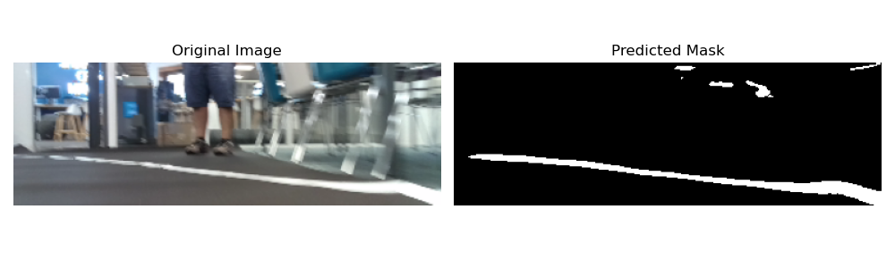
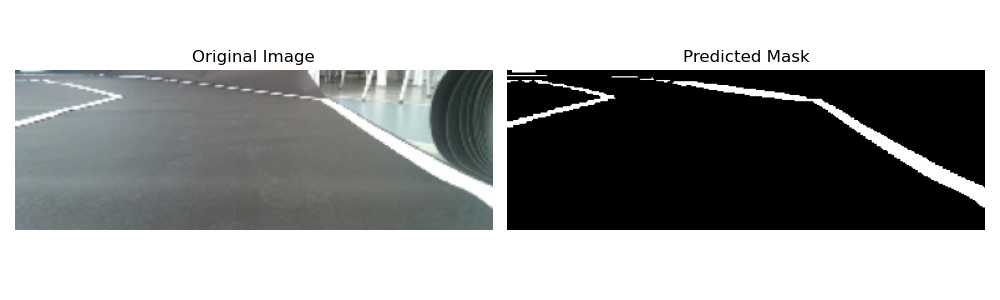
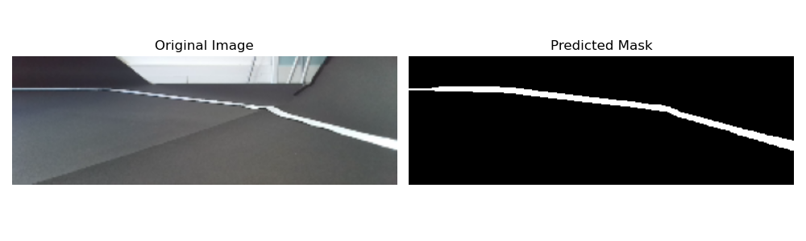

# 🧠 Mask Generator – Road Line Segmentation for Autonomous Driving

## 🚗 Project Overview

This project aims to train deep learning models capable of generating **binary segmentation masks** from input images, identifying white road lines that an autonomous vehicle should avoid crossing. These models are intended to be embedded later on a physical vehicle (Jetson Nano), but this repository focuses **exclusively on training and experimentation**.

The core architecture is a **custom U-Net**, built using PyTorch, optimized through various training strategies and automated hyperparameter tuning. The trained models can be exported to ONNX and quantized for deployment in embedded environments.

---

## 🚀 Features

- Custom U-Net architecture for road line segmentation
- Grid search & experiment automation with YAML config generation
- Metrics logging, result tracking, and reproducible training runs
- PyTorch-based training loop with configurable architecture and parameters
- ONNX model export and static quantization using `torch.quantization`

---

## ⚙️ Training

To train a model manually:

```bash
python mask_generator/train.py --config path/to/config.yaml
```

To launch multiple training runs with automatic config generation (grid search):

```bash
python scripts/launch.py
```

This will generate multiple experiment folders under `experiments/`, each with its own configuration, metrics, model checkpoints, and logs.

---

## 📦 Model Architecture

The segmentation model is based on a **custom U-Net**:
- Input: RGB image
- Output: Binary segmentation mask
- Encoder: Convolutional blocks with downsampling
- Decoder: Symmetric upsampling path with skip connections
- Final activation: Sigmoid
- Loss function: Binary Cross Entropy + Dice Loss (configurable)

---

## 🧪 Dataset

Two datasets are used during training and evaluation:

- **Training dataset**: Pairs of input images and masks collected from a driving simulator.
- **Test dataset**: A subset of **Molane**, which contains real road scenes similar to the robot car's operating conditions.

All datasets are loaded through a modular PyTorch `Dataset` class.

---

## 📉 Logging and Results

Each experiment logs:
- Training & validation loss
- IoU / Dice metrics per epoch
- Final metrics in `metrics.csv`
- Model weights: `model.pth`
- ONNX export: `model.onnx`
- Full training log: `experiment.log`

Optional integration with TensorBoard is supported via config.

---

## ⚡ Quantization & Export

The model can be exported to ONNX and quantized for embedded deployment:

- Static quantization using `torch.quantization`
- ONNX export for runtime integration (e.g., on Jetson Nano via TensorRT)

Note: The actual **inference and deployment pipeline** is handled in a separate project.

---

## 🛠 Environment

This project uses a Conda environment.

## 📊 Example Results

Below are examples of input images and their corresponding predicted masks.






